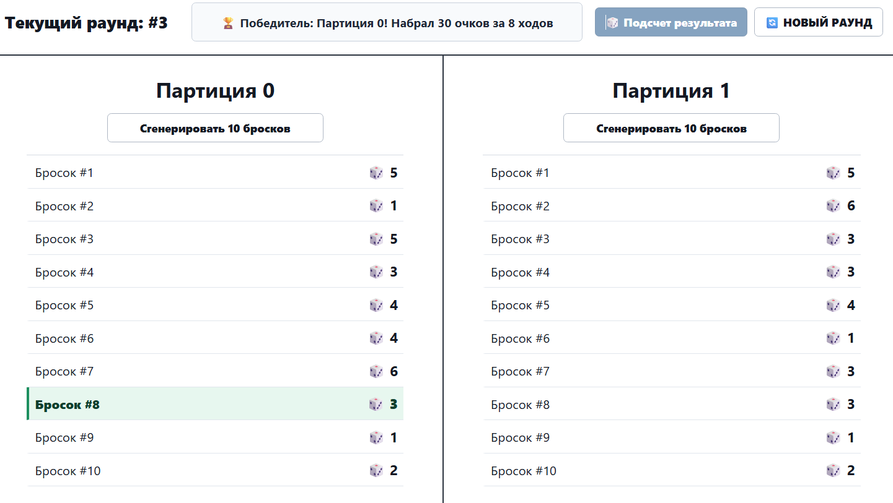
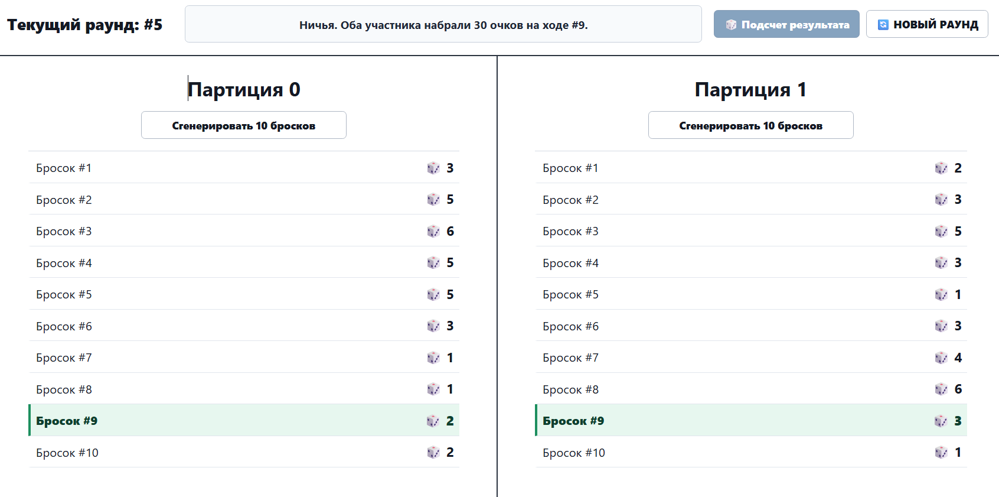
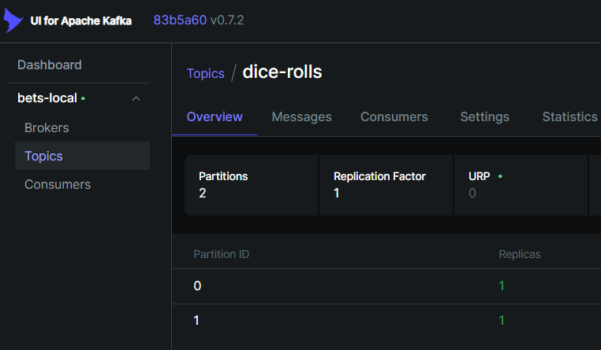
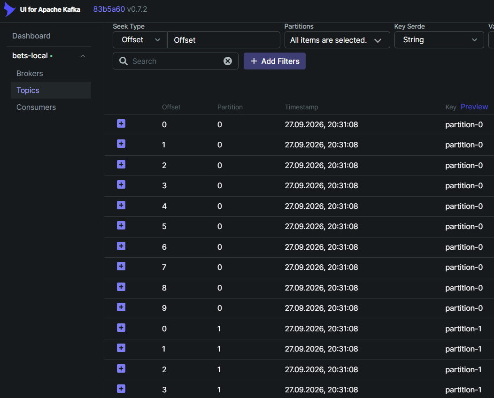

# Bets

Приложение для генерации бросков по двум Kafka-партициям и расчета победителя, используя многопоточность

## Асинхронность и многопоточность

Генерация бросков разделена по Kafka-партициям:
- `Партиция 0` хранит броски первого участника
- `Партиция 1` хранит броски второго участника

Backend отправляет сгенерированные броски в Kafka, а расчет результата читает данные из обеих партиций

При подсчете результата backend читает две Kafka-партиции параллельно. Для этого используется Java `StructuredTaskScope`:
- одна задача читает `Партиция 0`. Вторая задача читает `Партиция 1`
- основной поток ждет завершения обеих задач и передает данные в расчет победителя
- `StructuredTaskScope` дает структурированную многопоточность, дочерние задачи создаются внутри одного ограниченного scope

Инструменты:
- Kafka partitions — разделение потоков данных по партициям
- Java 25 `StructuredTaskScope` — параллельное чтение партиций
- virtual threads включены в Spring Boot через `spring.threads.virtual.enabled=true`

Стек:
- backend: Spring Boot 4, Java 25, Kafka
- frontend: React, TypeScript, Vite
- инфраструктура: Docker Compose, Kafka UI

## Скриншоты

Победа "Партиция 0"


Ничья


Структура партиций Kafka


Наполнение партиций Kafka


## Запуск через Docker

```bash
docker compose up --build -d
```

После запуска:
- frontend: `http://localhost:5173`
- backend: `http://localhost:8082`
- Kafka UI: `http://localhost:8081`
- Kafka broker: `localhost:9092`

## Автоматизированные тесты

Backend unit-, API- и Kafka-интеграционные тесты запускаются командой:

```bash
./gradlew :backend:test
```

Для Kafka-интеграционных тестов нужен Docker.

Frontend component-тесты и production-сборка:

```bash
cd frontend
npm ci
npm test
npm run build
```

Браузерные тесты используют Selenide. Если Chrome установлен локально, запустите приложение:

```bash
docker compose up -d backend frontend kafka
```

Затем запустите отдельную Gradle-задачу. В PowerShell:

```powershell
$env:E2E_BASE_URL = "http://localhost:5173"
Remove-Item Env:SELENIDE_REMOTE -ErrorAction SilentlyContinue
./gradlew.bat :backend:e2eTest
docker compose stop backend frontend kafka
```

Для удалённого Chrome, как в GitLab CI, используйте дополнительный Compose-файл:

```bash
docker compose -f docker-compose.yml -f docker-compose.e2e.yml up -d backend frontend kafka selenium
```

В PowerShell перед запуском Gradle укажите URL страницы и Selenium WebDriver:

```powershell
$env:E2E_BASE_URL = "http://frontend"
$env:SELENIDE_REMOTE = "http://localhost:4444"
./gradlew.bat :backend:e2eTest
docker compose -f docker-compose.yml -f docker-compose.e2e.yml stop backend frontend kafka selenium
```

GitLab runner для Kafka Testcontainers и браузерного этапа должен поддерживать Docker-in-Docker в privileged-режиме.
